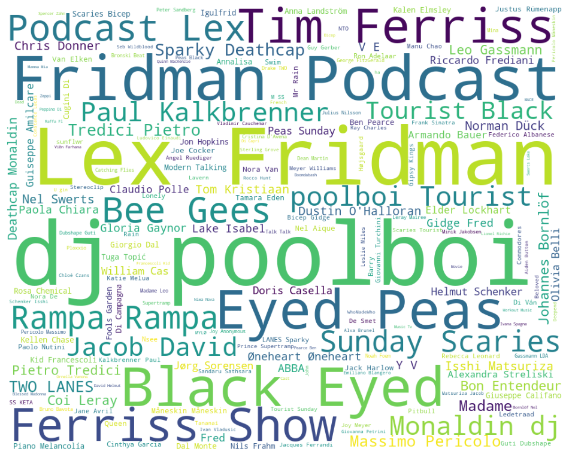
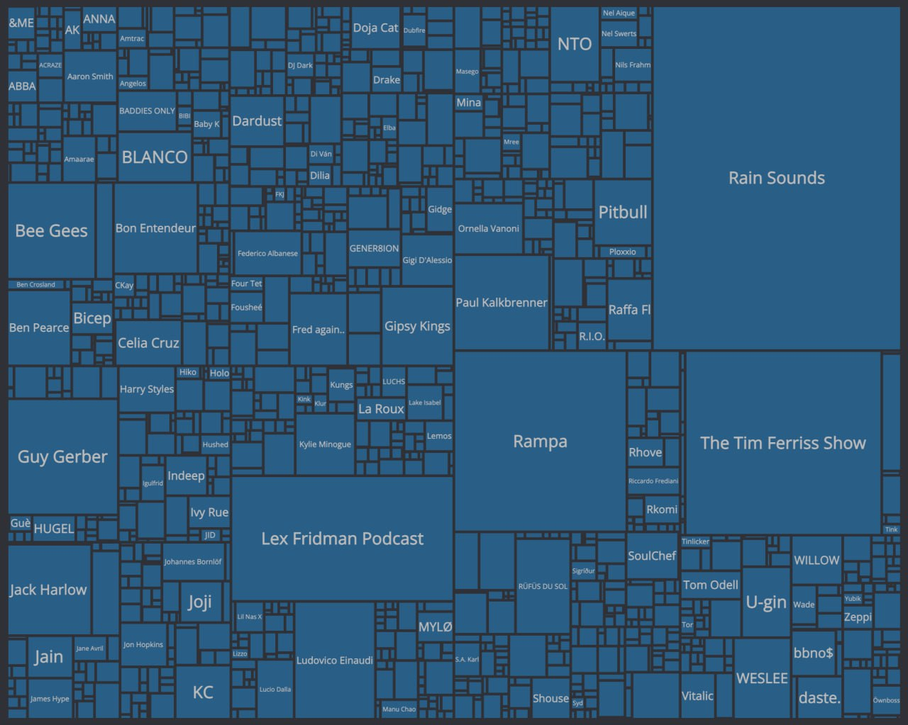
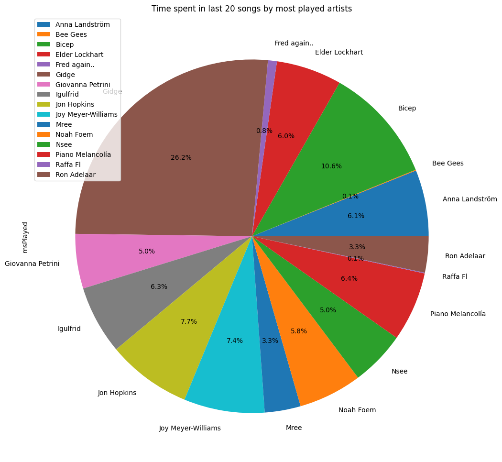
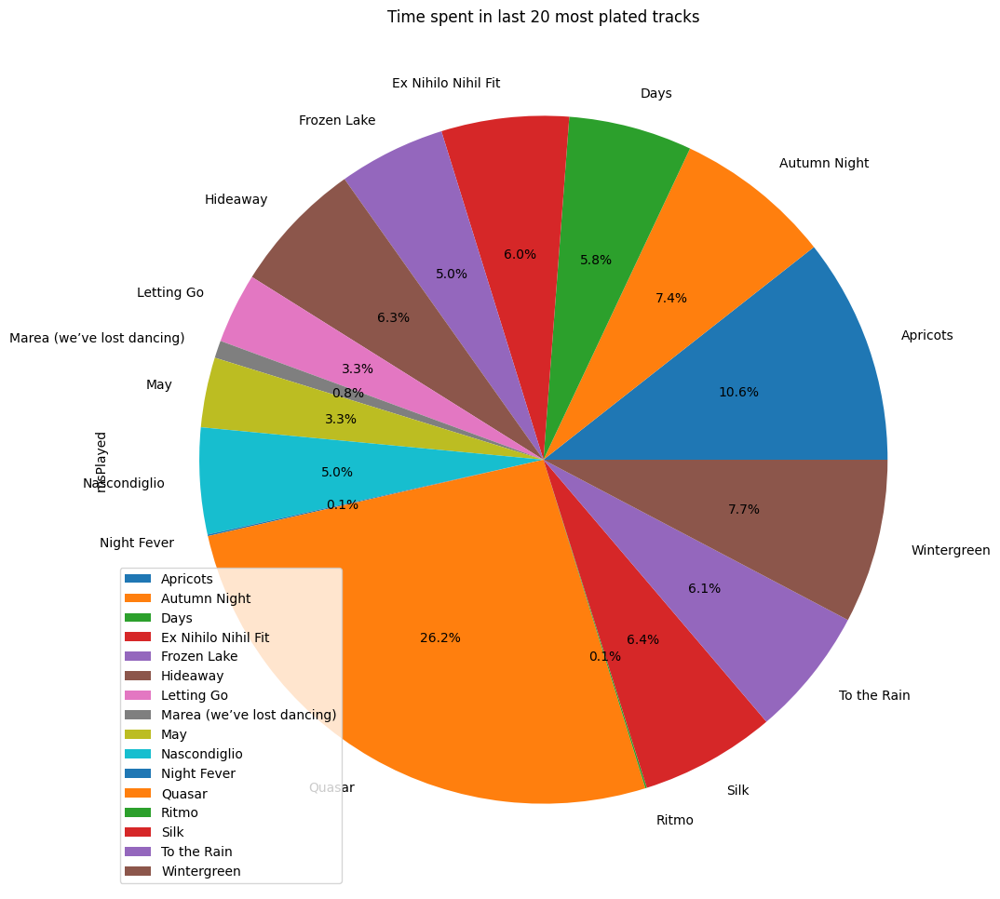
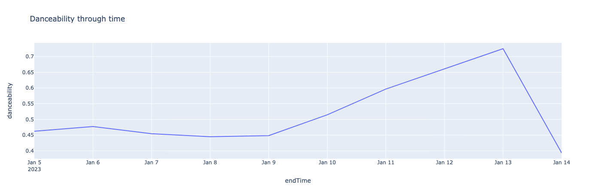
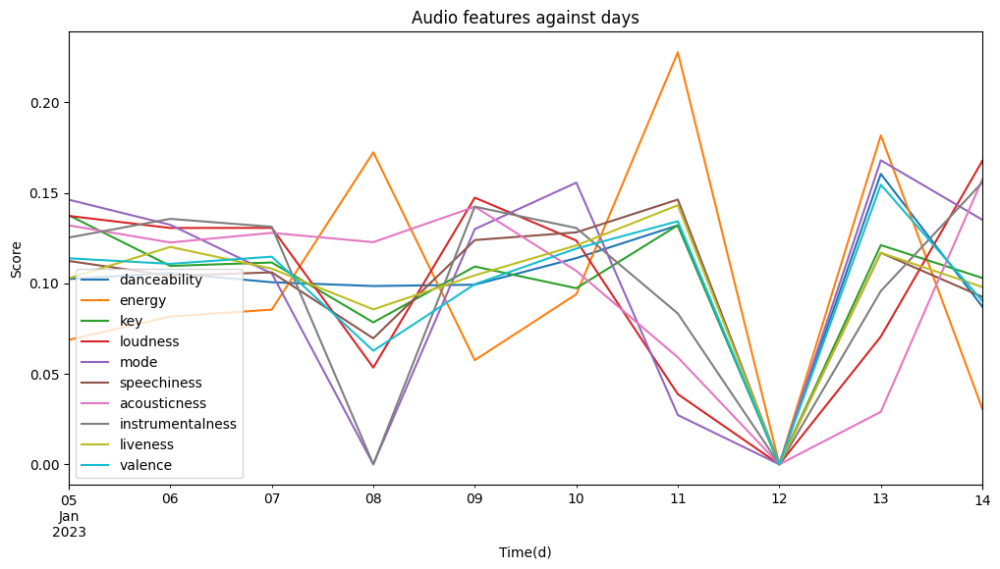
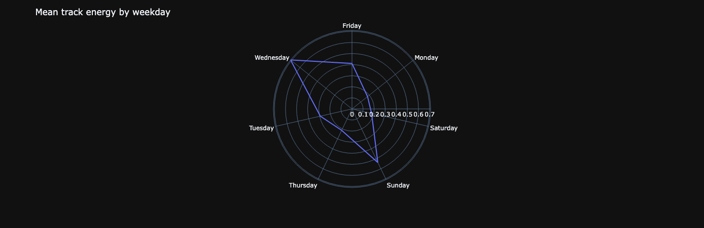

# Project of Data Visualization (COM-480)

| Student's name | SCIPER |
| -------------- | ------ |
| JacopoFerro | 299301 |
| Mark Mouawad | 296508 |
| Marcel Mauricio Moran Calderon | 344012 |

[Milestone 1](/milestone/milestone1.md) • [Milestone 2](#milestone-2) • [Milestone 3](#milestone-3)

## Milestone 1 (7th of April, 5pm)

**10% of the final grade**

This is a preliminary milestone to let you set up goals for your final project and assess the feasibility of your ideas.
Please, fill the following sections about your project.

*(max. 2000 characters per section)*

### Dataset
We have decided to use our own [personal data](https://support.spotify.com/us/article/data-rights-and-privacy-settings/) (which is available under the GDPR data rights) from Spotify and mix with other API sources, such as [Spotfiy API](https://developer.spotify.com/documentation/web-api) and [Spotipy](https://spotipy.readthedocs.io/en/2.22.1/).

Every user can download their own data from Spotify, which contains several datasets. The main data that we explored here is the Streaming History, which containts a list of tracks they have listened to, with the date and time of the listening session, the duration of the session in milliseconds and the name of the artist. Users will also see more specific files about their account and payements which will not be relevant for our project. The other datasets that might become relevant in the future are Playlist datasets, Search Queries and YourLibrary datasets. In this first analysis we will focus on the Streaming History dataset which is the most relevant for our project, but we did explore the other datasets as well and might use them to cross reference our data in combination with external APIs.

We downloaded our own data from Spotify which allows 3 different types of downloads. We had to wait to receive the data of the last year and at the moment of writing we are waiting for the full data of the account (one of our team members has been using Spotify for 10 years). We will use the data of the last year to start our analysis and notebooks and present our project, then we will use the full data once we receive it (it can take up to 30 days and will contain more datasets as well).

The following presentation and analysis is thus based mainly on the Streaming History dataset(s) of the past year of one of our team members. The dataset contains 10000 records from March 2022 to early January 2023 and 3300+ records from January 2023 to March 2023. The files are respectively 1.4MB and 0.5MB in size (uncompressed, in JSON format). 

Each record contains the following information:
```json

	{

		"endTime": date

		"artistName":  string

		"trackName": string

		"msPlayed": string

	}
```


With this information we were able to query the Spotify web API to get the album release date, its popularity following Spotify's criteria, its associated genres and the track's duration.  

In addition, we are using spotify's API audio features route. It returns a list of audio features for every track.  

```json

	{

		"danceability": number

		"energy":  number

		"key": number

		"loudness": number

		"acousticness": number

		"intrumentalness" : number

		"liveness": number

		"valence": number

		"tempo": number

	}
```


## Problematic
Big Tech companies have a lot of data about their users. They are able to use this data to provide personalized services and to target their users with ads. Some companies are more transparent about the data they collect and how they use it, and in general European laws are more strict about data privacy and protection and require companies to allow users to access their data. 

Instead of doing a project about aggregated data, we want to focus on the individual user and their data. Public data is often extremely interesting, it can show trends and patterns that are not visible when looking at the data of a single user. However, we think that the data of a single user can be even more interesting and it's actully at the core of revenue generation for big tech companies. 

We went on a quest to find a way to access our own data from platforms that we use every day, platforms in which we play more active or passive roles. We requested our data from Facebook, Instagram, Google, Spotify, Tinder and Apple. We were shocked by the results.

Discussing the details of each platform is out of the scope of this project, but we can say that we were fully convinced that we should pursue this approach and vision for our visualization. We decided that our project won't be focused on fear mongering or on the negative aspects of data collection, but rather on how it can be used to provide personalized insights about our own data and how the data itself really looks like in 'raw', which is also an interesting engineering challenge.

Combining the above considerations, we decided to focus on Spotify. We are interested in the data that Spotify collects about its users and how it can be used to provide personalized insights about their music consumption. Spotify was relatively slow in providing the data, but its quite organized, documented, and easy to understand for a non-technical user. Furthermore it's rich and detailed (we were surprised by the granularity), but not so much that it can't be easily processed and analyzed (100GB from Google, 6GB form Instagram etc...), it's also more broadly used and somewhat less stigmatized or controversial than other platforms (Twitter, Facebook, Tinder etc...).

We want to provide a tool and a guide to the single user (tech savvy or not) to get comfortable with the entire process, and answer the following questions specific to their own data:

- How do the periods of the year influence your music taste?
- What music do you listen to more on weekends compared to weekdays?
- What is your expected sentiment of the day or week by listening to these tracks?
- How did your music taste evolve over time?
- How much time do you spend listening to music? To which artists? To which genres? To podcasts?

We will make sure to provide a complete analysis with static data using our own (or a mix of our own data of the team members), and we will also provide a way to upload your own data and get personalized insights. This will bring several challenges on design, visualization, and engineering/development/computation, we are excited to tackle them.

## Exploratory Data Analysis
Analysis and exploration of dataset can be found in the [notebooks/Analysis.ipynb](./notebooks/Analysis.ipynb)

Below are some examples of visualizations we have found relevant.

**1. Word cloud visualization**
- Gives a quick glance into the most played artists / podcasts in your Spotify streaming history.
- We could think of turning it into an interactive word cloud, where clicking on an artist/podcast
name, will show similar artists for example.

*Your most played artists/podcasts*





**2. Pie Charts visualization**
- Highlights the difference in propotion for listening times. It may show
some pretty interesting cases, where a particular artist/track takes a huge place
in your listening times.

*The proportion of time spent listening to your top 20 artists/tracks*




**3. Line charts**
- Line charts are useful for plotting time series data. In this case, we use the "endTime" property
from the streaming history as our date time. It brings out the differences through periods of time (a year for ex)
-  We can plot a single feature as in the first chart below, or multiple ones together.




**4. Radar/spider charts**
- Particularly suited for example showing relevant metrics comparing average over weekdays, 
times of the days, months of the year or years.
-  We might use them for each one of the audio features, 
and also charting together multiple ones.





## Related Work

We think the originality of our approach is to actually leverage the fact that companies have legal obligations to deliver to a user their data usage in order to show personal insights.  

Past year's projects that inspired us were first [project-shazam-2022](https://github.com/com-480-data-visualization/datavis-project-2022-shazam) 
which analyzed Shazam's top tracks together with Spotify's API data and Genius lyrics data.  
Also [project-vizards-2022](https://github.com/com-480-data-visualization/datavis-project-2022-vizards) which analyzed Billboard's top 100 
hot songs with Google trends.

We were inspired by this [project](https://towardsdatascience.com/spotify-sentiment-analysis-8d48b0a492f2) we have found online by Lowri Williams. The project consists of doing sentiment analysis on Spotify data with lyrics information. We really liked the idea behind and the fact that it is a public tool that can be accessed by anyone.

However, we want to show some different insights using the track's playing times that weren't used in her project. Also we don't wish to focus much on sentiment analysis as her project does.

Her [radar chart](https://miro.medium.com/v2/resize:fit:1400/format:webp/1*0xKnvDtAV5u8pKV7xbnOJw.png) inspired us to do a similar one, but instead of having "positive", "negative" and "neutral". We will use the track features and also other date metrics instead of month, such as days of the week, years or time range in a day.

On top of that we want to add some more basic charts, such as time series line charts, pie charts with information about most played songs, artists. And also, more creative ones, such as bubble charts with the song features and an interactive timeline, so the user can scroll through time and visualize how their song features evolve.